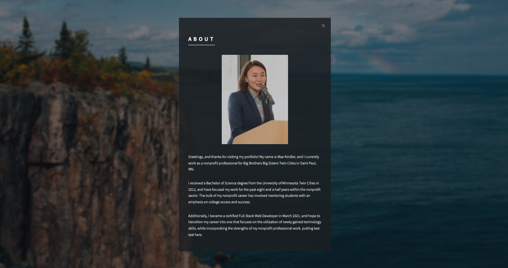
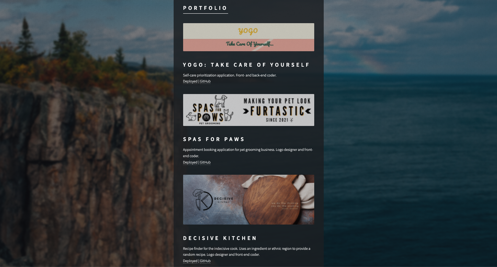

# BootstrapResponsivePortfolio

## Description

This project utilizes an HTML template, courtesy of `HTML5 UP`, to create a mobile responsive personal portfolio for Mae Kindler.

## Task

Included within this portfolio are three main sections, as follows:

- <b>About:</b> Shares information about who Mae Kindler is, where she currently works, and what some of her passions are.

- <b>Portfolio:</b> Displays thumbnails of projects that Mae has worked on collaboratively.

- <b>Contact:</b> A form that is designed to collect messages and contact information from users who visit the site and want to connect further with Mae. Additionally, links to Mae's GitHub, LinkedIn, and Instagram profiles are available, as well as the ability to send Mae an email and view her resume.

## Usage

This online portfolio can be shared with those who are interested in learning more about who Mae Kindler is, including her background, education, current career, and passions. Additionally, those who visit the website are provided with the opportunity to contact Mae, should they wish to connect further.

## Installation

This project will require a user to have:

- `Git Bash` (Windows), `Terminal` (Mac), or another application for executing commands to/from one's local machine.
- Code editor installed, such as `Visual Studio Code`.
- Access to `HTML5 UP`, which is freely available online at https://html5up.net/.
- Version control system, such as `GitHub`, to fork, clone, push, and pull the original repository, and to upload the final project to one's own version control system account.

## Process

- This project was made possible with code from `HTML5 UP`, and includes `HTML`, `CSS`, and `JavaScript`

## Link to Deployed Website

https://mkindler.github.io/BootstrapResponsivePortfolio/

## Screenshots of Deployed Website

<b><i>The images below are current as of January 3, 2022.</i></b>

**Home Page**

**About Page**

**Portfolio Page**

**Contact Page**

## Contributing

Please open a New Issue via GitHub for pull requests on this project that includes a description of what you would like to change.

## Acknowledgment

- Trilogy Education Services
- [HTML5 UP](https://html5up.net/)
- [Unsplash](https://unsplash.com/)

## License

&#169; Mae Kindler
MIT License
